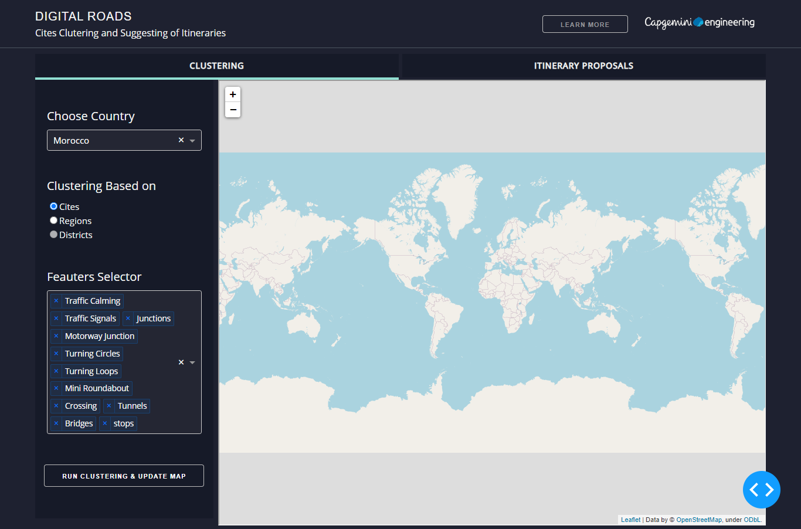
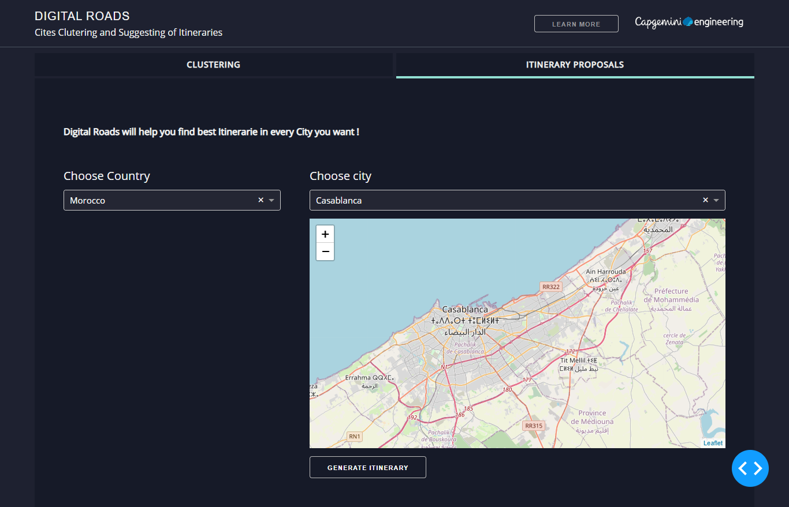

# DIGITAL ROADS DASHBOAR

## Introduction
`DIGITAL ROADS DASHBOAR` is a dashboard for cites clustering and suggesting of itineraries. 


## Screenshots





## Built With
* [Dash](https://dash.plot.ly/) - Main server and interactive components 
* [Plotly Python](https://plot.ly/python/) - Used to create the interactive plots


## Requirements
We suggest you to create a separate virtual environment running Python 3 for this app, and install all of the required dependencies there. Run in Terminal/Command Prompt:

```
git clone https://github.com/ZiadFellahIdrissi/Digital-Roads.git
cd Digital-Roads
python3 -m virtualenv venv
```
In UNIX system: 

```
source venv/bin/activate
```
In Windows: 

```
venv\Scripts\activate
```

To install all of the required packages to this environment, simply run:

```
pip install -r requirements.txt
```

and all of the required `pip` packages, will be installed, and the app will be able to run.


## How to use this app

Run this app locally by:
```
python app.py
```
Open http://127.0.0.1:8050/ in your browser, you will see Digital Roads dashboard.
